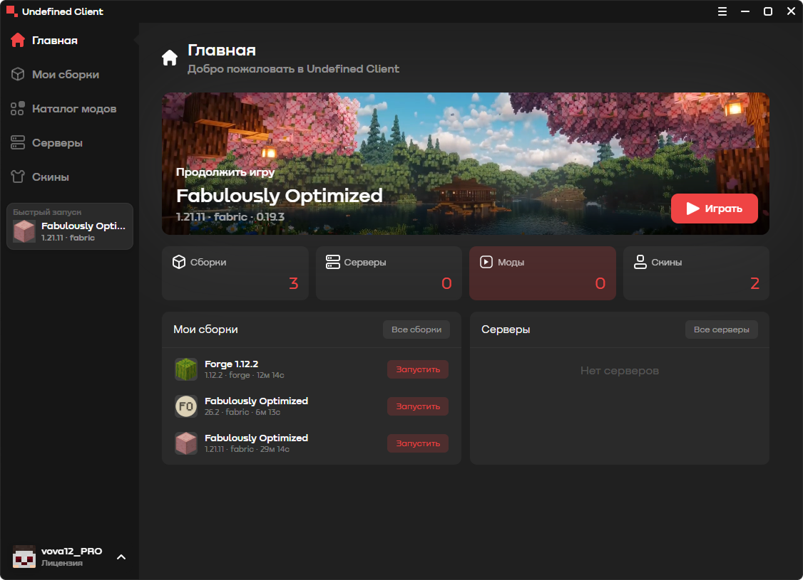
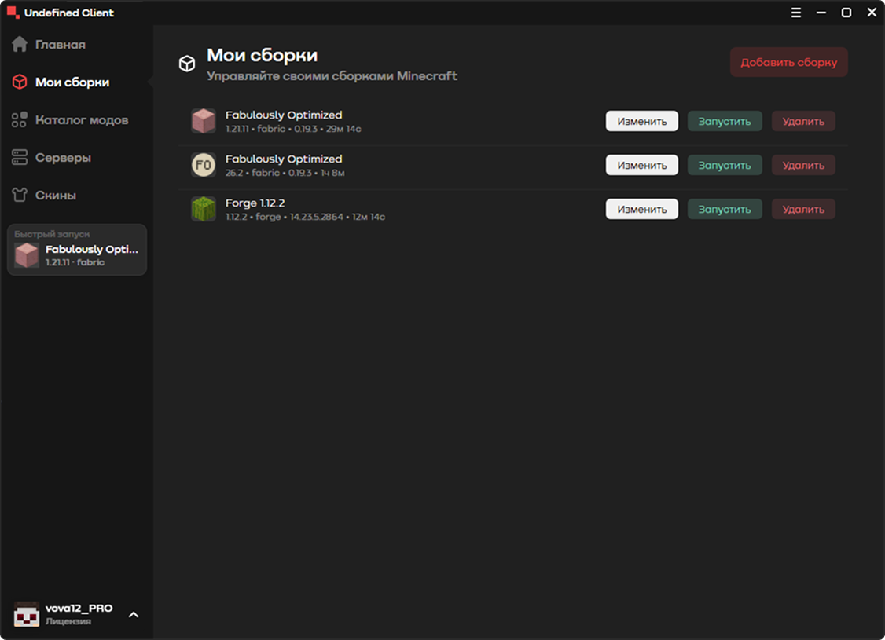
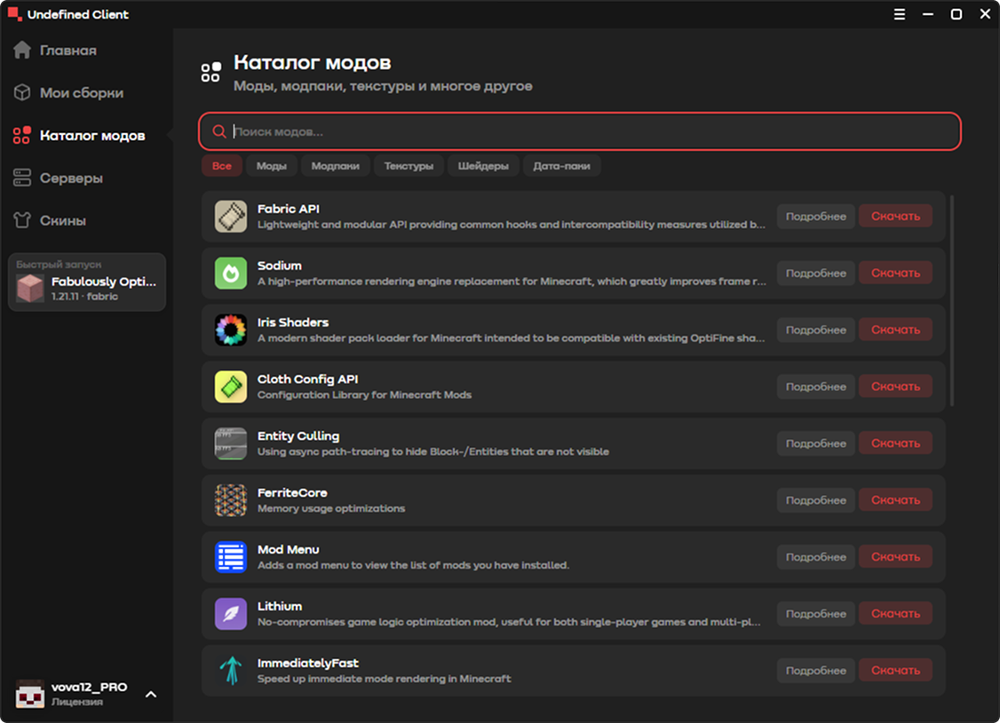
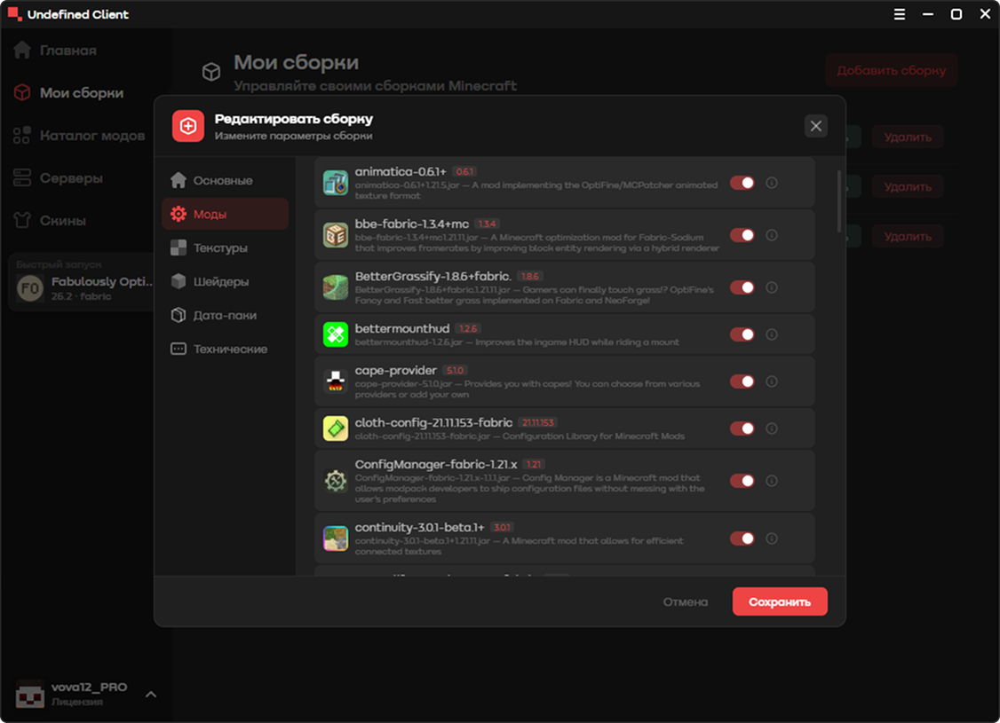
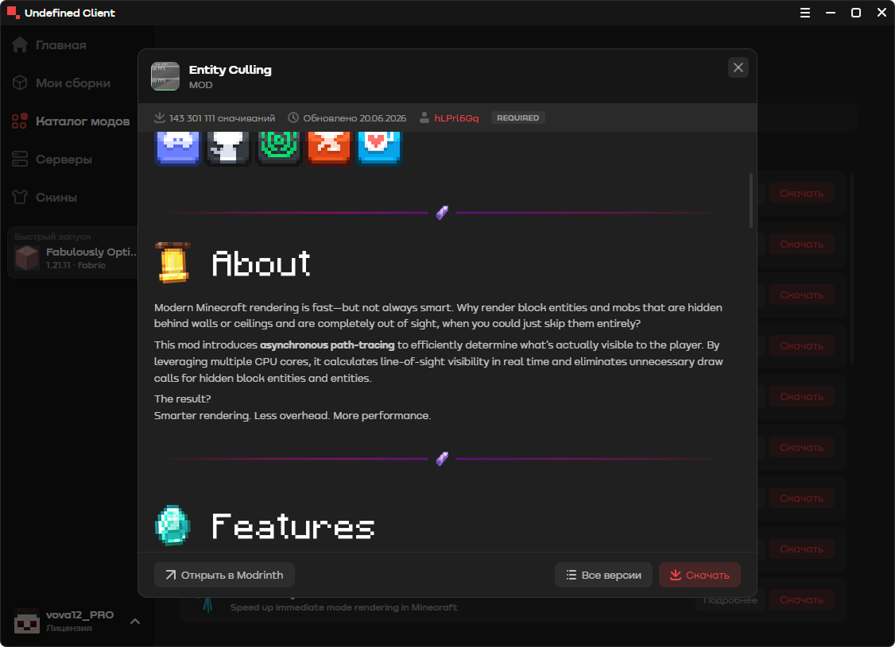
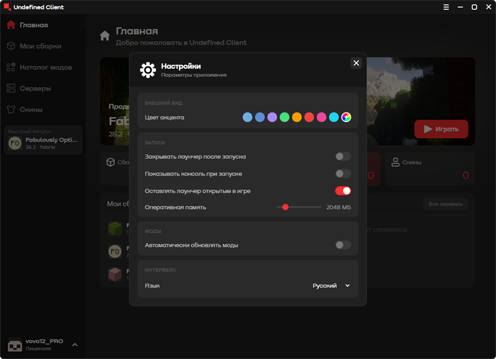
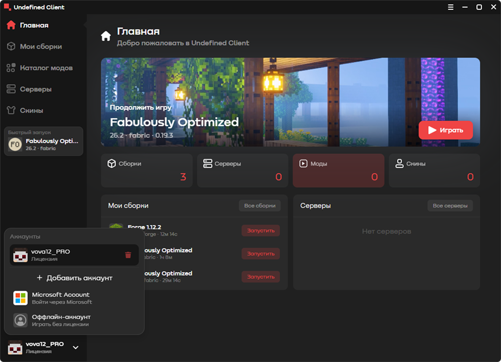

[](LICENSE)
[](package.json)
[](package.json)
[](package.json)

---

Привет! 👋 Это **Undefined Client** — лаунчер Minecraft на Electron с каталогом модов прямо из Modrinth, 3D-просмотром скинов, поддержкой Forge и Fabric и кучей мелочей, которые делают жизнь проще. Собирай сборки, ставь моды в два клика и играй — без боли и шаманства с jar-файлами.

> [!NOTE]
> Проект активно развивается, интерфейс на русском. Если найдёшь баг — открывай issue, а лучше сразу PR 😉

---

## ✨ Что уже умеет

| | |
|---|---|
| 🏠 **Домашний экран** — статистика, быстрый доступ к сборкам, серверам, модам и скинам | 📦 **Каталог модов Modrinth** — поиск, категории, страница мода с markdown-описанием |
| 🧩 **Сборки (инстансы)** — свои версии Minecraft, загрузчики Forge/Fabric, настройка RAM, логи запуска | 🎨 **Скины** — 3D-просмотр модели (three.js), сохранение скинов в локальную библиотеку |
| 👤 **Аккаунты** — вход через Microsoft и оффлайн-режим, быстрое переключение | 🖥️ **Серверы** — список любимых серверов под рукой |
| ⚙️ **Настройки клиента** — всё в одном месте, без рытья по файлам | 🔌 **Discord Rich Presence** — статус «играю в Minecraft» прямо в Discord |
| 🧠 **Кеш модов** — метаданные Modrinth сохраняются локально, каталог открывается мгновенно | 🔧 **Forge 1.12.2** — запуск старого доброго Forge, включая проблемные версии |

## 🖼️ Как это выглядит

| | |
|---|---|
|  |  |
|  |  |
|  |  |
|  | |

## 🛠️ Технологии

- **Electron 43** + **TypeScript 5.3** — ядро лаунчера
- **eml-lib 2.6** — запуск Minecraft (версии, загрузчики, auth)
- **Modrinth API** — каталог модов и установка
- **three.js / skin3d** — 3D-просмотр скинов
- **marked** — рендер описаний модов в markdown
- **discord-rpc** — Rich Presence
- **electron-builder** — сборка Windows-установщика

## 🚀 Быстрый старт

> [!IMPORTANT]
> Понадобится **Node.js 20+** (LTS) и npm. Проверь: `node -v`

```bash
# 1. Клонируй репозиторий
git clone https://github.com/studioberry-hub/client.git
cd uclient

# 2. Ставь зависимости
npm install

# 3. Запускай в dev-режиме
npm run dev
```

> [!TIP]
> `npm run dev` собирает TypeScript, бандлит рендерер и запускает лаунчер — всё за одну команду. Используй её при разработке.

## 🏗️ Сборка для Windows

```bash
npm run dist
```

Сборка идёт через **electron-builder**: бандлит приложение и собирает **NSIS-установщик** (exe). Результат появится в папке `dist-windows/`.

Что умеет установщик:

- выбор папки установки (по умолчанию — в `AppData`, без прав администратора);
- ярлык на рабочем столе;
- корректное удаление через «Установка и удаление программ».

> [!WARNING]
> Первая сборка скачивает Electron и дополнительные бинарники (~100 МБ) — нужен интернет. Антивирус может настороженно реагировать на свежесобранные exe, это нормально.

> [!NOTE]
> Сборка проверена на Windows 10/11. macOS и Linux не собираются через `npm run dist` — но если очень хочется, запусти `npm run dev` и посмотри, как поведёт себя рендерер 😉

## 📜 Скрипты

| Команда | Что делает |
|---|---|
| `npm run build` | Компиляция TypeScript + бандл рендерера через esbuild |
| `npm run start` | Сборка + запуск лаунчера |
| `npm run dev` | Сборка + запуск в dev-режиме (рекомендуется для разработки) |
| `npm run dist` | Сборка Windows-установщика в `dist-windows/` |

## 📁 Структура проекта

```
uclient/
├── src/
│   ├── main/          # Главный процесс Electron
│   │   ├── main.ts    # Окно, shell, IPC-каналы
│   │   └── launcher.ts# Запуск Minecraft, Modrinth, auth, Discord RPC, скины
│   ├── preload/       # Мост между процессами (preload.ts)
│   └── renderer/      # Интерфейс (app.ts, index.html, styles)
├── assets/
│   ├── images/        # Логотипы
│   ├── screenshots/   # Скриншоты для README
│   ├── fonts/         # Шрифты интерфейса
│   └── tabsIcons/     # Иконки вкладок
├── dist/              # Результат сборки TypeScript
├── dist-windows/      # Готовые установщики Windows
├── IconForBuild/      # Иконки приложения
├── LICENSE            # GPL-3.0 + доп. условия (аддендум)
├── CONTRIBUTING.md    # Правила вклада и ребазинг форков
└── CLA.md             # Соглашение контрибьютора
```

## 🗺️ Статус и планы

| Статус | Функция | Комментарий |
|:---:|---|---|
| ✅ | Сборки: версии, Forge/Fabric, RAM, логи | Работает, включая Forge 1.12.2 |
| ✅ | Каталог модов Modrinth с кешем | Поиск, категории, страница мода |
| ✅ | Установка мода в сборку | Из каталога, с автоопределением версии |
| ✅ | Аккаунты Microsoft + оффлайн | Быстрое переключение |
| ✅ | 3D-просмотр скинов | Библиотека скинов локально |
| ✅ | Discord Rich Presence | Статус игры |
| 🧪 | Импорт `.mrpack` | Пока через поиск Modrinth, полноценный импорт в планах |
| 🔜 | Автообновление лаунчера | Доставка новых версий без ручной установки |
| 🔜 | Ресурспаки / шейдеры / датапаки | Установка из каталога в сборку |
| 🔜 | Докачка и кеш скачивания | Более умная работа с сетью |
| 🔜 | Готовые шаблоны сборок | «Модпаки в один клик» |
| 🔜 | Сборки для macOS и Linux | Приоритет ниже, но двери открыты |

## 🤝 Вклад и лицензия

Проект распространяется по **GNU GPL-3.0** с дополнительными условиями (атрибуция, маркировка изменений, товарные знаки) — полный текст в [LICENSE](LICENSE).

Прежде чем писать код, загляни в [CONTRIBUTING.md](CONTRIBUTING.md) — там порядок работы с PR и условие актуализации форков (ребазинг к новым релизам в течение 30 дней). Вклад лицензируется по [CLA.md](CLA.md) — принимается подписью `Signed-off-by` в коммитах (`git commit -s`).

> [!CAUTION]
> Присвоение авторства проекта, удаление уведомлений об авторстве и использование названия **«UClient»** и логотипов без письменного согласия автора запрещены. Уважай труд разработчиков — и они будут рады твоим PR! ❤️

---

<div align="center">

Сделано с 💚 для Minecraft-сообщества • [Контрибьютинг](CONTRIBUTING.md) • [Лицензия](LICENSE) • Undefined Studios

</div>
